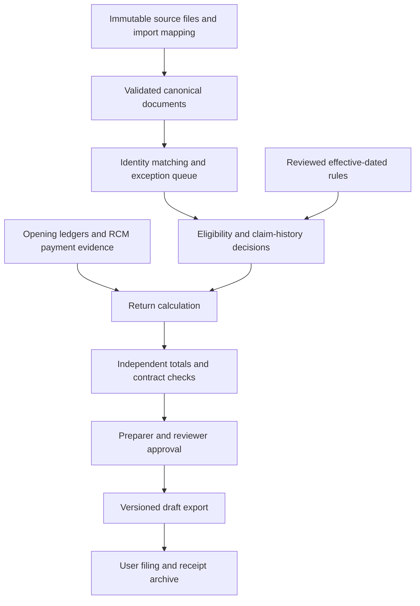

# Professional usefulness and architecture review

**Historical audit:** implementation has since changed. See [HARDENING.md](HARDENING.md) for fixes and remaining limitations, and [README.md](README.md) for current commands. The product target is CA-reviewed preparation, not unattended filing.

Reviewed 8 September 2026. Scope: local preparation pipeline, representative GST/ITC cases, CA and CHA workflows, developer architecture and user documentation. CHA is interpreted as Customs House Agent / customs broker.

## Verdict

**Useful foundation; not ready for unattended professional filing.** The strongest product direction is a local GST reconciliation and preparation workbench for accountants, with a separate import-IGST module later. Keep the deterministic engines, structured outputs and separation of user filing from preparation.

For a CA, the value is faster preparation and exception investigation. The remaining problem is reliable tax treatment, traceability and review controls, not raw invoice-processing speed. For a CHA, there is potential around books–BoE–2B reconciliation, but the current import path is insufficient. A CHA's own GST return and their client's customs clearance are separate workflows.

## What was verified

- Installed the existing locked dependencies with `uv sync --extra all`.
- Ran the existing suite: **227 passed**, reported aggregate statement coverage **80%**, Python 3.14.7, approximately 30 seconds.
- Ran `uv run ruff check .`: passed.
- Ran the bundled end-to-end pipeline without PDF: succeeded and generated draft JSON and Markdown artifacts.
- Executed additional synthetic probes for blocked credit, tax-head mismatches, taxable-value mismatches, invoice-number collisions, import routing, 40% validation, outward RCM and late-claim cutoff behaviour.
- Used graph discovery first, project `home-quantavil-Projects-gstr-wala`, generation `2026-09-08T05:21:22Z`, Verify tier. Coverage reported `scripts/`, `examples/` and `tests/fixtures/` excluded; implementation findings therefore use direct source reads and runtime probes, not inferred graph completeness.

This is a targeted review, not exhaustive statutory certification, a penetration test or proof of live portal compatibility. No real client data, portal credentials or live filing were used. The PDF command is documented from implementation and existing tests; no separate visual PDF audit was performed. Source changes in this review are documentation only.

## Current pipeline and its practical boundaries

| Stage | Actual behaviour | Professional requirement |
|---|---|---|
| Import | Separate CSV/Excel parsers produce canonical JSON; pipeline itself reads JSON | Show mappings, original rows, imported/rejected counts and control totals |
| Validation | Pipeline validates sales, then loosely coerces purchases and flattens 2B | Validate every source and cross-check taxpayer, period and document identity |
| Reconciliation | Standard matcher pairs records, classifies some ITC and directly totals Table 4 | Separate identity matching from legal eligibility, claim history and approval |
| GSTR-1 | Aggregation plus a draft serializer | Trace every table total to source documents and validate using current official tooling |
| GSTR-3B bridge | Copies outward summaries and reconciliation into 3B, defaulting several sections and ledgers to zero | Explicit completeness checks for RCM, ledgers, imports, reclaim and special categories |
| Set-off | Computes credit use and cash/challan estimates | Use verified ledger balances and distinguish proposed cash payment from confirmed payment |
| Export | Writes files before final schema checks; emits reports and optional PDF | Publish one validated, versioned artifact set after review |
| Filing | User must complete portal steps | Record reviewed version, filed return, ARN and payment receipts |

See [the README](README.md) for executable preparation instructions and output definitions.

## Corrections to prioritise

### P0 — Table 4 gross credit and reversals are inconsistent

In [reconcile_gstr2b.py](scripts/reconcile_gstr2b.py), blocked and Rule 37 records leave the normal matching path before inclusion in gross ordinary ITC. Their amounts are subsequently deducted as reversals from that reduced gross balance.

Runtime probe: one matched current-period invoice with IGST 180, marked blocked, produced ordinary gross ITC 0, reversal 180 and net ITC **-180**. No historical claim was supplied. This is not correct gross-and-reversal reporting for that isolated transaction. A legitimate prior-period reversal can produce negative net ITC, so simply clamping negatives is not a fix.

Correct by modelling gross availment, current and historical reversals, eligibility exclusions and reclaims separately. Preserve the Table 4(A) minus 4(B) relationship per head without excluding and reversing the same current-period credit twice. Link historical reversals to the earlier claim. Add practitioner-approved test cases for wholly blocked, partly unpaid, fully paid, prior-period reversal and reclaim.

GSTN distinguishes these Table 4 categories and the net relationship in its [Table 4 advisory](https://tutorial.gst.gov.in/downloads/news/advisory_of_label_change_in_GSTR_3B_02_09_2022.pdf).

### P0 — Import credit can disappear on matching, or be claimed while unmatched

In the same reconciler, import and ISD totals are populated from the **unmatched** 2B loop. Matched import/ISD records are excluded from ordinary ITC but are not added to the corresponding special bucket.

Synthetic nested BoE probes with IGST 180 returned:

| Input condition | Table 4(A)(1) result |
|---|---:|
| BoE in 2B, no books record | 180 |
| Same BoE matched to books using the engine's ICEGATE identifier | 0 |
| Unmatched BoE marked `itcavl=N` | 180 |

The unmatched special-section path bypasses the eligibility checks applied to matched records. Fix section routing independently of match status, then enforce evidence and eligibility before a claim proposal. Inspect ISD through the same correction.

For CHA use, model an import document by recipient GSTIN, port code, BoE number and date, with amendment/version information. The current normalisation substitutes `ctin=ICEGATE` and loses port identity. Do not match an overseas supplier invoice number as though it were a BoE number. GST Portal's [BoE search guide](https://tutorial.gst.gov.in/userguide/taxpayersdashboard/Manual_boe.htm) uses port, BoE number and date/reference-date information.

### P0 — “Exact” and “tolerance” do not establish invoice equivalence

[The standard matcher](scripts/reconcile_gstr2b.py) uses normalised invoice numbers or trailing digits, then compares total tax and taxable value. It does not require equality of each tax head, date or fiscal-year identity.

Reproduced with synthetic invoices:

- Books CGST 90 + SGST 90 versus 2B IGST 180: classified as exact when taxable values agreed.
- Taxable value 99,999 in books versus 1,000 in 2B, same tax: tolerance-matched and included in ordinary credit.
- Invoice `OTHER-1` versus `INV-1`, same supplier and amounts: classified as exact through trailing-digit fallback.

Use supplier + document type + financial year + invoice number as identity context, retain original strings, compare date/POS and each tax head, and label fuzzy candidates separately. Ambiguous candidates must require review. Do not silently promote a candidate to exact or treat a tolerance label as legal eligibility.

The [existing reconciliation tests](tests/test_recon_truth.py) explicitly describe single-axis tolerance as expected behaviour. Correcting this needs new business expectations as well as implementation changes.

### P0 — Purchase/2B validation and date context are incomplete

[cli.py](scripts/cli.py) treats an unrecognised purchase object as zero invoices and silently removes non-object rows. It does not bind 2B recipient GSTIN/period to the sales taxpayer/period. It calls reconciliation without passing the actual filing date, then uses that date later for statutory dues.

A probe with an April 2024 invoice and October 2025 2B matched using the default cutoff, but was classified ineligible when explicitly evaluated on 10 December 2025. Therefore a late-filing pipeline can use different dates for ITC eligibility and dues. The Section 16(4) helper also does not model earlier annual-return filing and treats a missing invoice date as not expired.

Reject malformed registers, missing critical fields and taxpayer/period conflicts before writing outputs. Introduce an explicit evaluation context: filing scheme, period, claim date, applicable due date, annual-return context and rule snapshot. Distinguish an explicitly confirmed empty register from a failed import.

### P0 — RCM liability must be independent of ITC eligibility

[The bridge](scripts/bridge_gstr1_to_gstr3b.py) derives inward RCM liability from the reconciler's eligible RCM ITC bucket. Consequently, a blocked RCM purchase can lose its cash liability when removed from that bucket. RCM missing from 2B cannot be reliably inferred through this path, and import-services ITC is initialised to zero.

Separately, the bridge's B2B outward loop does not branch on `rchrg`. A probe changing the sample invoices to `rchrg=Y` left its own taxable outward totals unchanged. This matters for professionals whose supplies may have recipient-paid tax treatment.

Build inward RCM liability from a dedicated books/RCM schedule, irrespective of credit eligibility and 2B presence. Track proposed payment, confirmed payment and eligible claim separately. Route outward recipient-paid supplies correctly, preserving the relevant declaration without automatically treating it as supplier-paid liability.

### P1 — HSN-based blocked credit is too broad

[constants.py](scripts/constants.py) includes 8704 and broad transport/service codes in `BLOCKED_HSNS`. [The classifier](scripts/reconcile_gstr2b.py) automatically blocks an exact code match even when `is_blocked_17_5=False`. Longer HSNs are not matched by this exact-string shortcut, so behaviour also changes with code length.

Section 17(5) has use-dependent restrictions and exceptions; a goods vehicle or transport service cannot be classified by this list alone. Replace automatic rejection with category flags and explicit business-use/exception decisions backed by evidence. This is especially significant for logistics and CHA clients. See [CBIC's Section 17 text](https://taxinformation.cbic.gov.in/content-page/explore-act/1000286/1000001).

### P1 — The advertised rule currency is not established

[rules_manifest.json](config/rules_manifest.json) has a 2026 label but omits 40% from allowed rates; the validator rejected 40% in a runtime probe. The official [Notification 9/2025–Integrated Tax (Rate)](https://taxinformation.cbic.gov.in/view-pdf/1010431/ENG/Notifications) includes a 40% schedule. Its indexed official search text was available; direct PDF retrieval timed out during review.

Do not simply replace the rate list or delete historical rates. Implement effective-dated, supply-specific rules with source notification, commencement date and version. The same principle applies to thresholds, due dates and waivers.

[Advisory discovery](scripts/discover_statutory_rules.py) defaults to bundled data, and live mode is a title/link scan with fallback. Passing tests after a numeric patch establishes internal behaviour, not that legislation has been correctly interpreted. Freeze a reviewed rule snapshot for each run.

### P1 — DRC “SAFE” messages overstate what is checked

[The pipeline](scripts/cli.py) compares its own derived 3B to the same input sources. The 2B comparison baseline is derived from the same reconciliation buckets used to populate 3B. This can pass despite omissions shared by both sides.

[The radar](scripts/bridge_gstr1_to_gstr3b.py) labels configured thresholds as statutory notice triggers, returns “SAFE”, and calculates zero percentage when the 2B baseline is zero. No authoritative basis for the repository's exact universal numerical thresholds was established in this review. Official [DRC-01B](https://tutorial.gst.gov.in/downloads/news/return_compliance_in_form_drc_01b.pdf) and [DRC-01C](https://tutorial.gst.gov.in/downloads/news/return_compliance_itc_mismatch_intimation_in_form_gst_drc_01c.pdf) guidance should govern interpretation.

Report internal variance with limitations, compare independently obtained portal statements and reviewed return versions, and handle zero baselines explicitly. Never promise notice immunity.

### P1 — Draft publication needs a validation and approval boundary

[cli.py](scripts/cli.py) writes portal JSON before checking project schemas, does not call the 3B input validator before its direct serializer invocation, overwrites fixed filenames, and does not surface sales warnings. Its direct sales validator call bypasses the credential-key wrapper in [validate_gst_input.py](scripts/validate_gst_input.py).

Compute in a staging directory; validate all inputs, accounting invariants and output contracts; then publish atomically. Add a run identifier, source hashes, rule version, decision log and reviewer state. Failed or unreviewed runs should remain visibly drafts. Wire the same validation service into every entry point.

### P1 — User-facing claims exceed the contract

[The fast engine](scripts/reconcile_fast.py) already warns that statutory classification is skipped. The former README presented it as the reconciliation solution without this distinction. Generic parsers also need explicit mappings; PDF rendering is not automated OCR bookkeeping; locally computed output viewed by hosted AI is not zero-outbound processing.

[GSTR-3B serialization](scripts/generate_gstr3b_json.py) uses a project provenance version marker. Local schemas and tests labelled “official” do not independently prove live portal acceptance. Generated PDFs cannot establish CA certification.

The rewritten README corrects these claims. The older SKILL.md, AGENT.md and reference text should subsequently be reconciled with the corrected product contract; their stronger guarantees are not validated by this review.

## Recommended architecture

Retain a modular Python application. Microservices would add deployment work before the accounting model is reliable.

Suggested modules:

| Module | Responsibility |
|---|---|
| `ingestion` | Source adapters, column mappings, raw row/page references and import reports |
| `domain` | Invoice, note, BoE, payment, taxpayer, period and typed money models |
| `matching` | Exact identities and separately labelled candidate suggestions |
| `compliance` | Eligibility, reversals/reclaims, effective-dated rules and decision reasons |
| `returns` | GSTR table calculation from reviewed records |
| `ledgers` | Opening balances, RCM liability/payment, utilisation and deposit estimates |
| `exports` | Current output adapters and official-tool compatibility fixtures |
| `workspace` | Local SQLite review state plus immutable files and audit history |
| `interfaces` | CLI initially; a local browser UI after correctness stabilises |

Use one policy/eligibility implementation for both standard and accelerated matching. Acceleration should change candidate generation, not tax treatment. Keep Decimal or integer paise through calculations; current code frequently converts back to floats, and permissive numeric helpers can turn invalid values into zero. Restrict permissive handling to explicit import diagnostics.

Record prior claims, reversals and reclaims across periods. Stateless processing of one purchase register and one 2B cannot establish whether credit has already been claimed. Preserve historic runs rather than retroactively applying a changed global manifest.

## How it should behave for a practising CA

1. Select client GSTIN and filing period; confirm filing scheme and rule snapshot.
2. Import books and portal statements; show row counts, totals, mapping and rejected records.
3. Review invoice exceptions with source evidence and distinct match/eligibility statuses.
4. Complete opening ledgers, RCM, credit notes, prior claims/reclaims and special schedules.
5. Review return tables with drill-down to each source and decision.
6. A second reviewer approves a fixed version; edits invalidate that approval.
7. Export, validate through applicable portal tooling, then archive filed returns and receipts.

For non-developers, the eventual local UI should have Clients, Imports, Exceptions, Return Preview and Filing Archive screens. Add CSV exception export and vendor follow-up drafts before adding automatic communications.

## How it should behave for a CHA

Separate two products/workspaces: the broker's own GST compliance and importer-client import-credit support. For the latter, reconcile purchase/GRN records, BoE and amendments, customs tax-payment evidence, GST Portal/2B data, and IMS status where applicable. Preserve port, importer GSTIN, BoE date/number, IGST and cess; keep basic customs duty and other charges distinct from GST ITC.

Show missing BoEs, timing differences, amendments, duplicate documents, wrong GSTIN, unmatched book entries and disputed tax amounts. An unmatched portal import must be a review case, not automatic eligible credit. Keep customs clearance, shipping bills, duty assessment, refunds and operational job management outside the initial GST preparation release unless explicitly built.

GSTN's indexed [October 2025 import-in-IMS advisory](https://tutorial.gst.gov.in/downloads/news/creative_advisory_on_boe_in_ims_final_30th_october_2025.pdf) signals that IMS context matters. Direct retrieval returned 404 during this review; verify the current advisory through the portal before implementing exact status behaviour.

## Delivery priorities and acceptance gates

| Order | Deliverable | Evidence needed before proceeding |
|---|---|---|
| 1 | Correct Table 4, imports/ISD, matching, RCM and input/date validation | Practitioner-approved regressions for all reproduced cases |
| 2 | Effective-dated rules and independent output checks | Current notifications, representative past/current periods, actual official-tool validation |
| 3 | Local client/period workspaces and review decisions | Reproducible reruns, no duplicate claims, immutable approved artifacts |
| 4 | Accountant-facing local UI and exception exports | Observed trial with a CA using authorised, locally held data |
| 5 | Dedicated CHA import reconciliation | Validated BoE/IMS scenarios and reviewed credit decisions |
| 6 | Optimisation and distribution | Standard/fast policy parity and clean-install resource tests |

Keep the existing suite, but add expected results independent of implementation: tax-head conservation, gross-minus-reversal, unique document matching, matched-versus-unmatched import consistency, taxpayer isolation, late claim dates, recipient-paid outward tax and failure-without-final-artifacts. Do not treat schema conformance, benchmark speed or test count as a substitute for these gates.
