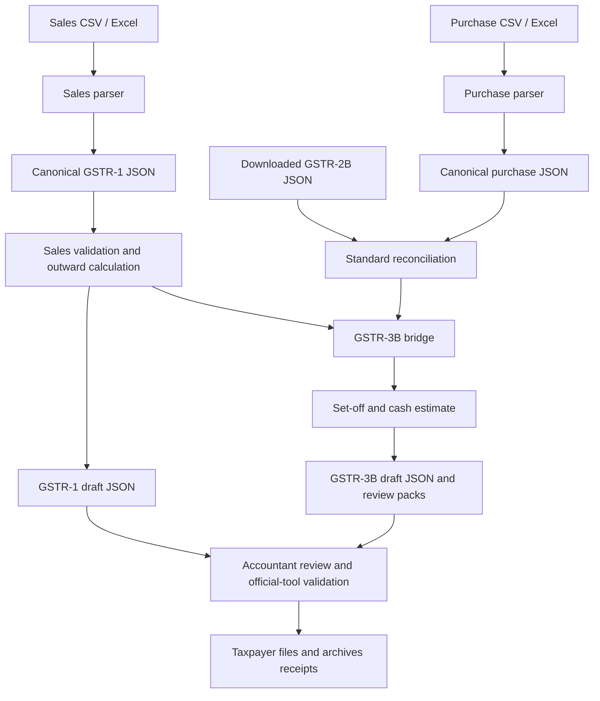

# gstr-wala

Local Python tools for preparing GSTR-1, reconciling purchases with GSTR-2B, drafting GSTR-3B, and estimating ITC set-off and cash requirements. Includes an optional AI-agent workflow in [SKILL.md](SKILL.md).

**Status: preparation tool requiring CA review.** The engine prepares a draft and one consolidated exception list for professional review. [HARDENING.md](HARDENING.md) lists implemented corrections and remaining scope limits; [PROJECT_REVIEW.md](PROJECT_REVIEW.md) preserves the original audit. A generated statement is a computation draft, not a CA certification. A measured 95–99% automation/accuracy claim has not yet been established against independent CA-approved returns.

## Who is it useful for?

| User | Useful for | Current limitation |
|---|---|---|
| Accountant / CA | Outward summaries, purchase investigations, draft set-off computations | Manual tax review required; no client-management or approval application |
| Business owner | Preparing records for an accountant | Command-line software, not a guided filing app |
| CHA / customs broker | Exploring import-IGST reconciliation and GST on the broker's own business | Not customs-clearance software; BoE matching requires complete identity and eligibility review |
| Developer | Parsers, calculation modules, schemas and tests | Portal acceptance and legal correctness need independent verification |

This guide covers regular monthly taxpayers. A complete QRMP/IFF workflow, composition returns, customs declarations, refunds and automatic portal filing are outside its scope. An explicit quarterly due date does not implement quarterly aggregation.

## Install

Use Python 3.12+ and `uv`. Run all commands from the repository root. Shell examples use Bash on Linux/macOS; Windows users can use WSL.

```bash
git clone https://github.com/quantavil/gstr-wala.git
cd gstr-wala
uv sync
uv run gstr-wala --help
```

Optional dependencies:

```bash
uv sync --extra pdf   # PDF statements; WeasyPrint may need OS libraries
uv sync --extra all   # PDF support plus development/test tools
uv run pytest -q
uv run ruff check .
```

Use a repository checkout: scripts locate configuration and schemas relative to it. A standalone wheel installation is not the documented deployment method.

## First run: demonstration

Use a fresh output directory: the pipeline refuses to overwrite an earlier run and publishes files only after the complete run succeeds.

```bash
uv run gstr-wala pipeline \
  --sales examples/sample_sales_register.json \
  --purchases examples/sample_purchase_register.json \
  --gstr2b examples/sample_gstr2b.json \
  --output-dir output/demo-01 \
  --no-pdf
```

These are demonstration records, not returns to upload. Success means artifacts were generated and checked against repository schemas; it does not establish tax correctness or portal acceptance. The samples include blocked-credit data and are not a golden tax answer.

## Input → processing → output



PDF ingestion is a separate preparation step: it extracts digital text or renders pages. It does not automatically turn invoices into validated register entries.

## Prepare your own records

Keep separate folders for each client GSTIN, period and run. Preserve original exports and store financial records outside the source repository on access-controlled storage. Replace `CLIENT` and `042026` below.

```bash
mkdir -p ../gst-records/CLIENT/042026/docs
mkdir -p ../gst-records/CLIENT/042026/work
mkdir -p ../gst-records/CLIENT/042026/output
```

Collect sales, purchases and downloaded GSTR-2B for the same taxpayer and period. Separately collect opening electronic credit/cash ledgers, actual filing date, applicable due date, turnover slab, payment ageing, notes, RCM records and import documents where relevant. The pipeline does not verify or ingest all of these automatically.

### 1. Map CSV / Excel columns

Use one header row, without title or subtotal rows. Excel parsing reads the first worksheet. Preserve identifiers and state codes as text. Prefer dates such as `05-04-2026`; the return period is `MMYYYY`, such as `042026`.

| Meaning | Sales column | Purchase column |
|---|---|---|
| Invoice identity | `invoice_number`, `invoice_date` | `invoice_number`, `invoice_date` |
| Counterparty | `customer_gstin` (blank for unregistered) | `supplier_gstin` |
| Place of supply | `pos` | `pos` |
| Taxable amount | `taxable_value` | `taxable_value` |
| Rate | `gst_rate` | Not used to calculate purchase tax |
| Tax amounts | `igst`, `cgst`, `sgst`, `cess` | `igst`, `cgst`, `sgst`, `cess` |
| Item details | `hsn`, `description`, `uqc`, `quantity` | `hsn_sc` (also accepts `hsn`, `hsn_code`, `sac`) |
| Review inputs | `export_type` where applicable | `is_blocked_17_5`, `unpaid_days`, optional `unpaid_value` |

Supply explicit tax amounts, including zero where appropriate. Missing purchase amount fields become zero: inspect mapping before reconciling. The sales parser's `--derive-taxes` option explicitly enables derivation when tax columns are absent; use it only after verifying rates and POS.

Sales rows with the same invoice number become items of one invoice. Purchase rows remain separate records: consolidate invoice lines before purchase reconciliation. Check dates and POS across repeated sales rows; avoid relying on default POS inference for complex supplies.

Generic CSV conversion does not preserve every specialised field. For SEZ classification, outward RCM, notes, advances and other special cases, prepare and review canonical JSON against [the GSTR-1 input schema](schemas/gstr1_input_schema.json). Arbitrary accounting exports may need column mapping.

### 2. Convert and validate

Replace `YOUR_GSTIN` with the taxpayer's GSTIN. Parsers also accept `.xlsx`, `.xls` and `.xlsb`.

```bash
uv run python scripts/parse_sales_register.py \
  ../gst-records/CLIENT/042026/docs/sales.csv YOUR_GSTIN 042026 \
  ../gst-records/CLIENT/042026/work/gstr1_input.json

uv run python scripts/parse_purchase_register.py \
  ../gst-records/CLIENT/042026/docs/purchases.csv \
  ../gst-records/CLIENT/042026/work/purchase_register.json

uv run python scripts/validate_gst_input.py \
  ../gst-records/CLIENT/042026/work/gstr1_input.json
```

Review every warning and compare parsed counts and amounts with original exports. The standalone validator displays warnings and applies the credential-key check. `gstr-wala validate` supports canonical GSTR-1/3B inputs, not general purchase validation.

Sales JSON has `gstin`, `fp`, and an `invoices` array with `items`. Purchases use `{"purchases": [...]}` with `ctin`, `inum`, `idt`, `txval`, `iamt`, `camt`, `samt`, `csamt` per invoice. See [sales example](examples/sample_sales_register.json), [purchase example](examples/sample_purchase_register.json) and [2B example](examples/sample_gstr2b.json). Portal-shaped GSTR-1 JSON is not interchangeable with canonical input.

### 3. Reconcile and review

Use the standard engine. This standalone command produces machine-readable JSON:

```bash
uv run python scripts/reconcile_gstr2b.py \
  ../gst-records/CLIENT/042026/work/purchase_register.json \
  ../gst-records/CLIENT/042026/docs/gstr2b.json \
  --cutoff 20-05-2026 --json \
  > ../gst-records/CLIENT/042026/work/reconciliation.json
```

The cutoff is the Section 16(4) evaluation date: use the relevant actual claim date, not this example date. The complete pipeline forwards `--filing-date` to reconciliation. If omitted, the reconciliation default is derived from the 2B period; supply the actual date for late claims.

Where the relevant annual return has already been filed, supply `annual_return_filed_on` on the purchase record (DD-MM-YYYY). A fresh claim on or after that date is held as ineligible; verify the applicable financial year and any special statutory relief with the CA.

| Result | Review action |
|---|---|
| Exact / tolerance match | Identity/date must agree; taxable value and each tax head must be within ₹1. Review the overall totals and supporting evidence |
| Value mismatch | Investigate; the standard engine holds this credit out of ordinary ITC |
| In books only | Check period, supplier reporting, document type and timing; the supplier-not-filed explanation is not proof |
| In 2B only | Verify ownership, invoice/BoE, receipt and eligibility |
| Blocked / Rule 37 / ineligible | Gross credit and reversals are separately represented. Confirm the business-use decision, payment ageing and claim history |

`uv run gstr-wala reconcile PURCHASES.json GSTR2B.json --fast` is an exploratory matching accelerator. It skips Section 17(5), Rule 37, RCM and Section 16(4) classification. Its schema differs from standard reconciliation; do not feed it to the bridge for filing decisions.

### 4. Generate draft packs

```bash
uv run gstr-wala pipeline \
  --sales ../gst-records/CLIENT/042026/work/gstr1_input.json \
  --purchases ../gst-records/CLIENT/042026/work/purchase_register.json \
  --gstr2b ../gst-records/CLIENT/042026/docs/gstr2b.json \
  --output-dir ../gst-records/CLIENT/042026/output/run-01 \
  --due-date 20-05-2026 --filing-date 20-05-2026 \
  --turnover-slab upto_1.5cr --no-pdf
```

Replace dates and slab. Supported slabs: `upto_1.5cr`, `1.5cr_to_5cr`, `above_5cr`. Without dates, the bridge assumes the next month's 20th and on-time filing. Verify extensions and filing scheme separately.

The pipeline reruns reconciliation instead of consuming a saved reconciliation file. Add `--context ledgers.json` to supply verified opening balances; omitted ledgers default to zero and appear as a review issue. Example context:

```json
{
  "opening_credit_ledger": {"iamt": 0, "camt": 0, "samt": 0, "csamt": 0},
  "opening_cash_ledger": {"iamt": 0, "camt": 0, "samt": 0, "csamt": 0}
}
```

For staged preparation, use:

```bash
uv run python scripts/bridge_gstr1_to_gstr3b.py \
  ../gst-records/CLIENT/042026/work/gstr1_input.json \
  --recon ../gst-records/CLIENT/042026/work/reconciliation.json \
  --output ../gst-records/CLIENT/042026/work/gstr3b_input.json \
  --due-date 20-05-2026 --filing-date 20-05-2026
```

Review against [the GSTR-3B schema](schemas/gstr3b_input_schema.json). Opening ledger fields are `opening_credit_ledger` and `opening_cash_ledger`, each with `iamt`, `camt`, `samt`, `csamt`. Review import services, RCM, reclaimed ITC, reversals, exempt inward and ECO supplies; several categories default to zero. Changing ledgers or liabilities also requires reviewing interest/late fees: existing statutory-dues fields are retained rather than refreshed.

Validate the reviewed draft with `uv run python scripts/validate_gst_input.py REVIEWED_3B.json`. Generate its JSON with `uv run python scripts/generate_gstr3b_json.py REVIEWED_3B.json OUTPUT.json`. Generate corresponding packs with `uv run python scripts/generate_filing_pack.py SALES.json REVIEWED_3B.json RECONCILIATION.json OUTPUT_DIR`. Replace these placeholders with actual paths. Do not rerun the full pipeline over reviewed artifacts: it recreates its own draft.

## Review once and preserve the reviewed draft

Read `ca_review.md`, the detailed issues in `review_manifest.json`, and both return packs. Correct source mistakes and run preparation into a fresh directory. RCM credit requires explicit `rcm_paid: true`; liability remains payable independently. Import books records need `ctin: "ICEGATE"`, the BoE number/date and `port_code`. Mark `previously_claimed: true` to exclude an earlier claim from a fresh claim proposal; the tool does not yet maintain a cross-period claim ledger.

When the draft treatment is acceptable, create a JSON object with a decision note for **every** issue ID, for example `{"R0001": "Opening balances verified against downloaded ledgers"}`. Use the actual IDs and include all issues in your run. Then:

```bash
uv run gstr-wala approve-run output/demo-01 --reviewer "Reviewer name" --decisions decisions.json
uv run gstr-wala verify-run output/demo-01
```

Approval records review of the existing figures; it does not resolve a mismatch by changing tax amounts, file a return, or provide a professional digital signature. If figures need changing, correct inputs and prepare a new run first. Verification detects changed outputs and a changed manifest after approval. Keep the reviewed run intact.

## Output files

| File | Purpose |
|---|---|
| `ca_review.md` | Consolidated issues with stable IDs for this run |
| `review_manifest.json` | Source/output fingerprints, evaluation date and detailed issues |
| `rules_snapshot.json` | Exact rules file used by the preparation run |
| `review_approval.json` | Local reviewer record, created only by `approve-run` |
| `reconciliation.json` | Record-level matches/exceptions and computed ITC buckets |
| `reconciliation_report.md` | Human-readable purchase review |
| `gstr1_portal.json` | Draft outward payload; validate in applicable official tooling |
| `gstr3b_input.json` | Intermediate canonical 3B draft |
| `gstr3b_portal.json` | Draft 3B payload; direct portal acceptance has not been established |
| `gstr1_filing_pack.md` | Outward, HSN and document summaries |
| `gstr3b_filing_pack.md` | 3B, set-off and cash-deposit computation |
| `gstr3b_statement.pdf` | Optional printable draft; HTML fallback may be produced |

Cash/challan output is an estimate, not an actual PMT-06 challan or payment. DRC messages are internal comparisons, not guarantees against notices. The pipeline stages its outputs and removes the staged run on failure. Standalone scripts do not share directory-level publication: use fresh paths and validate their output.

## PDFs and AI assistants

### Monthly folder: what works today

Keep one taxpayer and one return period per input folder. Include all outward invoices for that period; keep notes/cancellations/amendments in a separate clearly labelled folder and existing portal downloads separately. Keep outputs outside the input tree. Archive older months separately; do not pass the whole financial year to a monthly run.

```bash
cd /path/to/gstr-wala
uv sync
uv run python -m scripts.extract_pdf_text /path/to/GST/2026-08/invoices /path/to/GST/2026-08/output/extracted_text.json
```

The extractor recursively reads all PDFs in that folder. Its JSON is **not uploadable to GST**. There is currently no unattended folder-to-GSTR-1 converter: extracted text must be mapped into reviewed canonical sales JSON before generation. Once `sales_reviewed.json` has been prepared:

```bash
uv run python scripts/validate_gst_input.py /path/to/GST/2026-08/sales_reviewed.json
# Proceed only if validation succeeds and review issues are resolved.
uv run python scripts/generate_gstr1_json.py /path/to/GST/2026-08/sales_reviewed.json /path/to/GST/2026-08/output/gstr1_portal.json
```

Use fresh output filenames. Validate the generated draft in applicable official tooling, inspect upload errors and reconcile the portal summary before filing. Successful local validation is not proof of portal acceptance or a complete return.

For a local/approved AI workflow, a suitable request is:

> Prepare a reviewed GSTR-1 draft for [GSTIN], period [MMYYYY], from [monthly folder]. Extract embedded PDF text locally without OCR. Inventory every document and report unreadable or excluded files. Map invoices to canonical sales JSON with source-page references; check duplicates, totals, notes, HSN/SAC and document summary. Derive missing POS only for confirmed domestic general B2B services, recording the basis; hold exceptions for review. Do not invent missing facts or claim the folder is complete without confirmation. Produce draft portal JSON and a concise review report. Do not upload, file, delete originals or overwrite previous outputs.

An AI-assisted mapping is not a tested automatic parser. Follow the financial-data privacy restrictions below when choosing where that AI runs.

### Place of supply defaults

CSV/Excel sales rows with a missing POS can use `pos_rule=domestic_b2b_general_services` after the domestic general-services classification is confirmed. The parser then derives POS from the validated recipient GSTIN and records `pos_basis`, surfaced in validation/CA review. Explicit POS takes priority; a different recipient GSTIN state produces a review warning. Missing/invalid GSTIN, conflicting `customer_state_code`, unknown classification and detected special cases stop conversion with `POS_REVIEW_REQUIRED`. Supply a reviewed explicit POS to resolve a hold. Keyword checks are supplementary, not a complete legal classifier; do not apply this default to all goods/services. This operates on extracted/normalized rows, not directly on PDF text.

For digital invoices, extract full embedded text and word coordinates locally, without OCR or images:

```bash
uv run python -m scripts.extract_pdf_text /path/to/2026-08/invoices /path/to/2026-08/output/extracted_text.json
```

This uses the existing PyMuPDF dependency. It preserves source hashes and page numbers, refuses output overwrite, and stops the batch on unreadable/textless pages. Text presence does not prove every invoice field was extracted. This JSON is extraction evidence, **not a GSTR-1 upload file**; field mapping, totals, tax classification and reviewer-confirmed missing fields are still required. Keep each return period in its own input folder and keep original invoices and reference outputs for repeatable regression checks.

```bash
uv run gstr-wala ingest-pdf docs/invoices/ --output-dir work/images/ --dpi 200
# Add --force-image to render digitally readable pages too.
uv run gstr-wala report REVIEWED_3B.json output/gstr3b_statement.pdf
```

PDF ingestion prepares text/images, not complete accounting records. Retain page references when extracting manually. [SKILL.md](SKILL.md) provides an optional agent workflow, subject to this README's known limitations.

Calculation scripts run locally, but a hosted AI assistant reading invoices or outputs sends that content to its provider. Local Python execution alone does not guarantee local AI processing. Do not give hosted models financial records under this project's zero-outbound-data policy. Never include portal passwords, OTPs or bank credentials.

## Before filing

1. Verify taxpayer, period, counts, classifications and every tax head against books.
2. Resolve reconciliation exceptions and independently check gross ITC, reversals and net ITC.
3. Check opening ledgers, RCM payment, dates and applicable rules with the accountant.
4. Validate outward JSON in the applicable official Returns Offline Tool. Compare 3B with the current portal workflow and auto-populated statement; repository schemas are insufficient.
5. The taxpayer performs login, upload/entry, payment, filing and EVC/DSC verification. Archive filed returns, ARN, receipts and approved working papers.

Official instructions: [GSTR-3B user guide](https://tutorial.gst.gov.in/userguide/returns/GSTR3B.htm) and [GSTR-2B FAQs](https://tutorial.gst.gov.in/userguide/returns/FAQ_gstr2b.htm).

## Troubleshooting

| Symptom | Action |
|---|---|
| Missing package / command | Run `uv sync` and use `uv run` from the checkout |
| No pytest | Run `uv sync --extra all` |
| Invalid GSTIN/date or missing invoice number | Correct source records; never invent replacements |
| Unsupported rate | Verify legislation and invoice date. The 40% format rate is supported from 22 September 2025; this is not an HSN-specific rate determination |
| Purchase validation error | Correct the array shape, required fields, GSTIN, dates, amounts or duplicate documents; malformed input is rejected |
| Held matches or negative balances | Resolve the listed exceptions. Negative ledger/liability cases need a reviewed adjustment schedule and are not silently clamped |
| Missing schema | Use a complete checkout containing `schemas/` |
| PDF fails | Use `--no-pdf`; inspect HTML fallback and WeasyPrint dependencies |
| Portal rejects JSON | Investigate in official tooling; changing a version tag alone proves nothing |

## Developer map and rule maintenance

`scripts/cli.py` orchestrates the engines, bridge, serializers and reports. `reconcile_gstr2b.py` performs standard reconciliation; `reconcile_fast.py` offers exploratory accelerated matching. `gst_engine.py` aggregates outward supplies and `itc_optimizer.py` computes set-off. `schemas/` holds project contracts, `config/rules_manifest.json` stores rules, and `tests/` holds automated checks.

`uv run python scripts/discover_statutory_rules.py` uses a bundled snapshot by default. Add `--live` to attempt public advisory discovery; inspect the source status because fallback is possible. Discovery and passing tests do not establish legal currency. Verify notifications and effective dates before using rule patches.

See [PROJECT_REVIEW.md](PROJECT_REVIEW.md) for evidence, architecture recommendations and release priorities.

## License

[GNU GPL v3](LICENSE).
